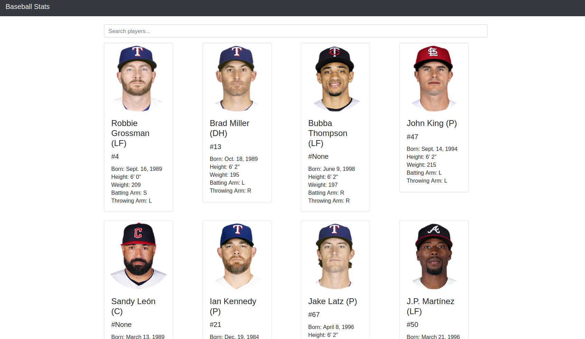

# Baseball Statistics Dashboard

    

## Introduction

### <a target="_blank" href="https://baseball.adamneighbors.com">Preview Here</a>

Just a small project to test display the usage of Django, Plotly, Postgresql and other technologies.

Webapp to work as a dashboard for MLB players and show some of their statistics. Currently only setup showing the 2023 World Series Champions the Texas Rangers, but can be expanded to all teams rather easily.

App shows basic hitting and pitching statistics for players; switching between based on the position of the player. Also shows a basic line chart to show different statistics per game.

I had grabbed all my data using the Tank01 MLB Live In-Game Real Time Statistics API found at rapidapi.com, but there may be better alternatives out there. Data was loaded using the management/commands/ scripts.

### Future Improvements
There are **SEVERAL** improvements that could be made to this app. In it's current state it is very bare bones, but is a good foundation for future improvements; such as those listed below.

- Add team based statistics
- Improve player statistics page
- Compare players with each other
- Update/Add charts and graphs

## Table of Contents

- [Introduction](#introduction)
- [Features](#features)
- [Requirements](#requirements)
- [Installation](#installation)
- [Usage](#usage)
- [Files Structure](#files-structure)
- [License](#license)

## Features

- View Player Statistics and Charts

## Requirements

Requirements include Django, Plotly, and Pandas. See requirements.txt for full list.

## Installation

1. Clone the repository.
2. Install the project dependencies using `pip install -r requirements.txt`.
3. Copy config.ini.sample to config.ini and fill in appropriate information.
4. Make migrations using `python manage.py makemigrations`.
5. Apply migrations using `python manage.py migrate`.
6. Load data in the prefered way. Default using Tank01 MLB Live In-Game Real Time Statistics API from rapidapi.com. (management/commands/)

## Usage

Server can be started using `python manage.py runserver`. As it is right now it's setup with postgresql, but can easily be edited to use whichever databases django supports.

## Files Structure

Follows basic django file structure, but some additional details can be found below.

- `views.py`: Contains view functions for rendering web pages.
- `models.py`: Defines Django models for the database.
- `charts.py`: Includes functions to generate Plotly charts.

## License

Copyright © 2024 Adam Neighbors under GPLv3
